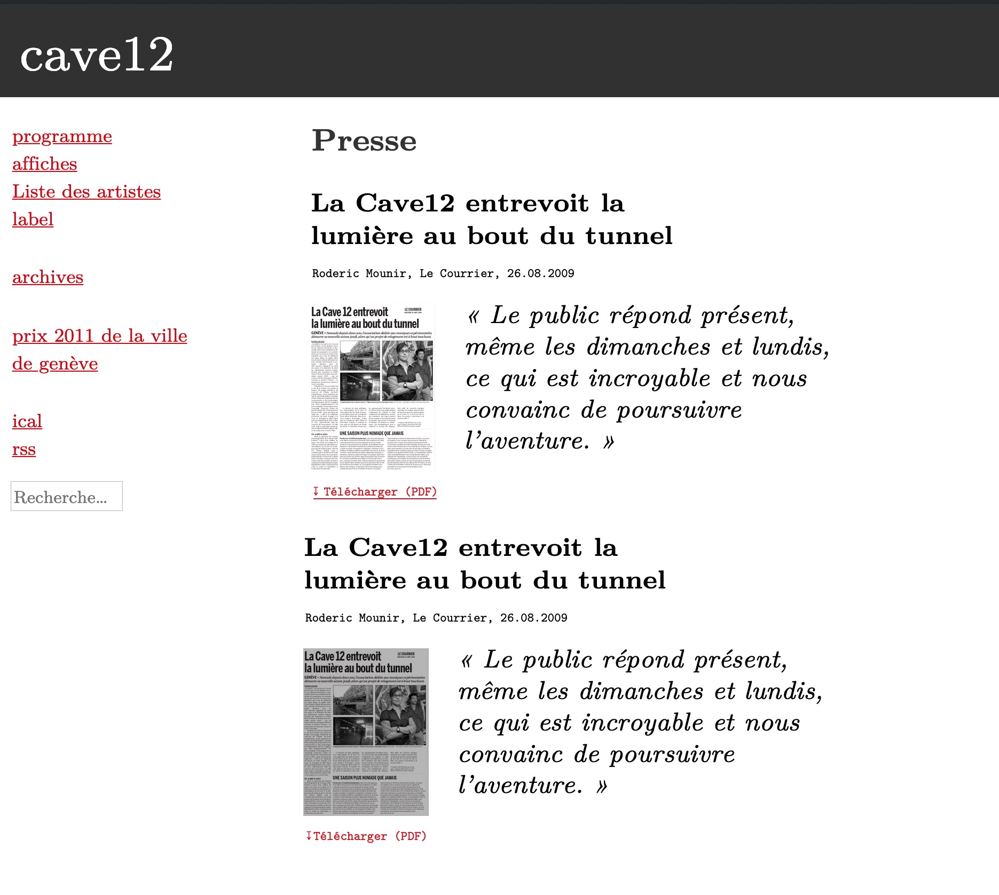

# Section Presse

En février 2019, nous ajoutons au site une section "Presse".
Voici comment cela fonctionne:

Il s'agit d'un nouveau type de contenu, déclaré au moyen de l'extension custom "[C12 Presse](https://github.com/cave12/c12-presse)".

Le modèle pour cette page:

Les besoins de ce type de contenu:

- Titre: post title
- Taxonomie: artistes (post_tag): on rend disponible cette taxonomie, ainsi on peut lier un article à un artiste.
- Taxonomie: thématiques (p.ex: label, nomadisme...)

## Champs ACF:

- Fichier joint (PDF ou image) "c12_presse_fichier"
- Source: champ de texte (TDG, Le Courier...) "c12_presse_source"
- Date de publication: champ de date (19.4.2010) "c12_presse_date"

## Le code :

- Déclaration du type de contenu: dans l'extension "C12 Presse"
- La page archive pour ce type de contenu: archive-presse.php
